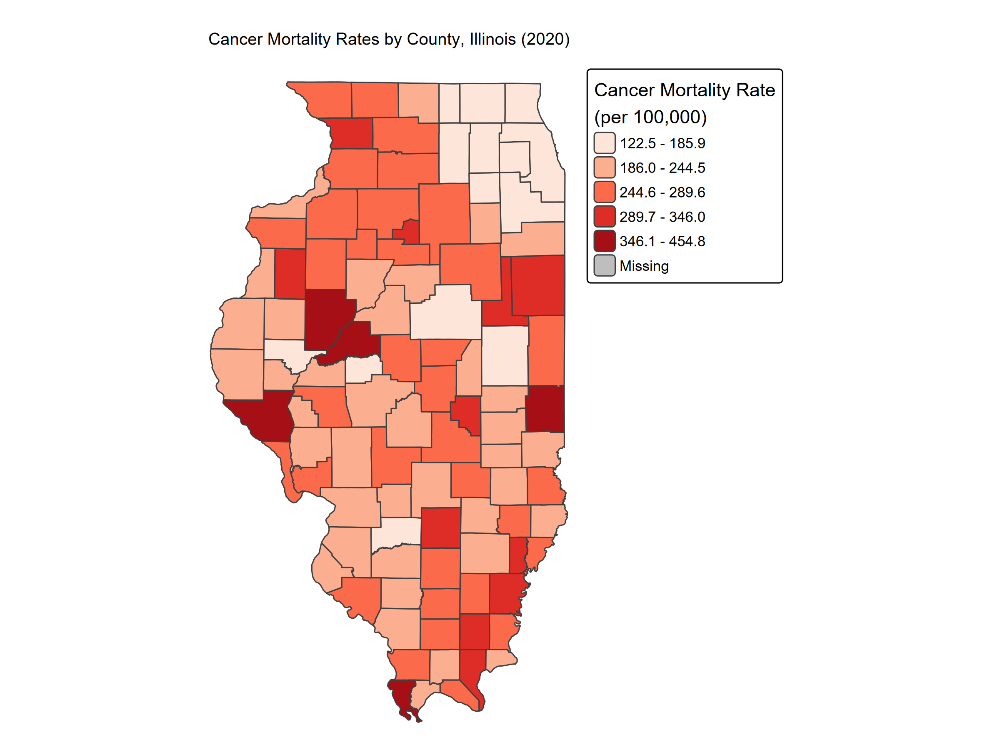
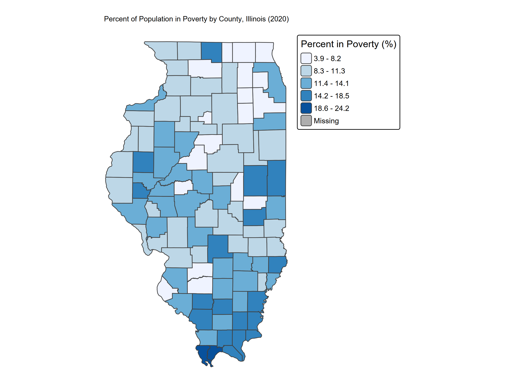
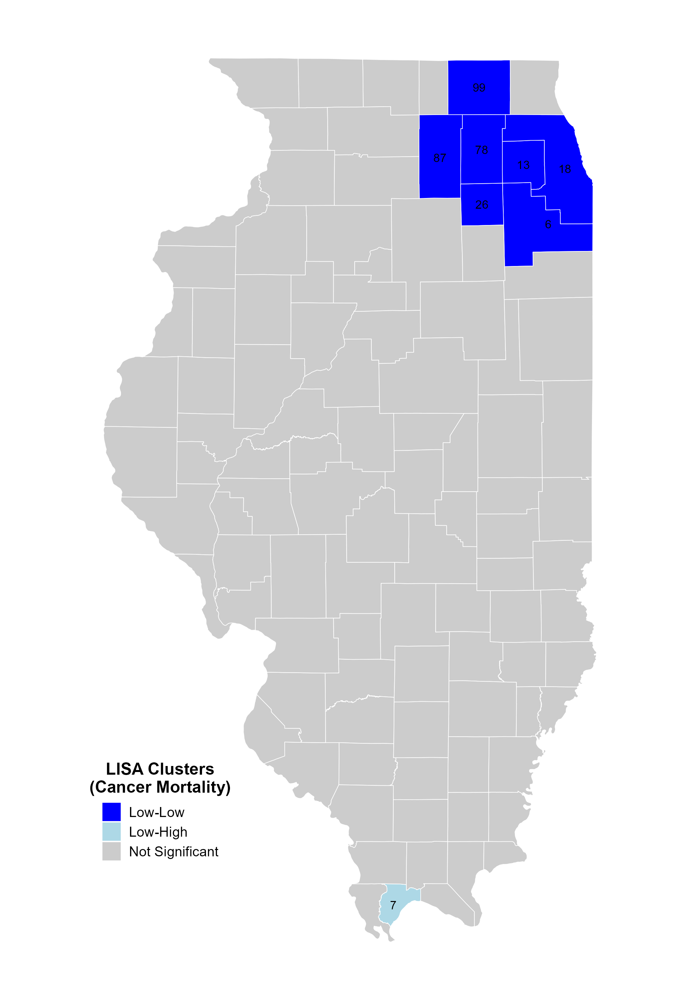
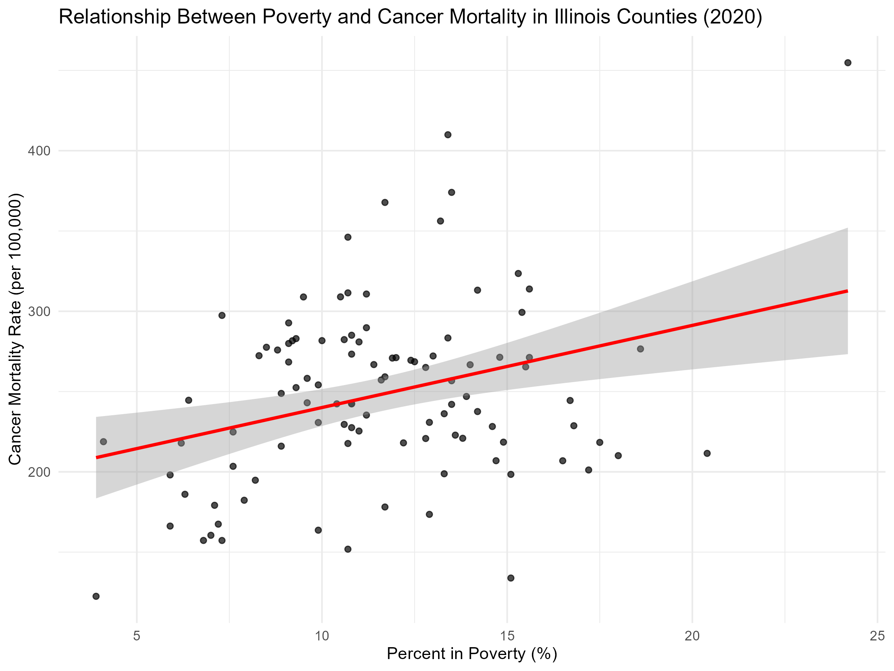

# Spatial Analysis of Cancer Mortality in Illinois (2020)

## Overview
This project analyzes the spatial distribution of cancer mortality across Illinois counties using GIS and spatial statistics in R.

The study focuses on identifying spatial clustering patterns, detecting hotspots using Local Moran’s I (LISA), and examining the relationship between cancer mortality and poverty.

---

## Study Area
Illinois, United States (County Level)

---

## Data Sources
- CDC WONDER – Cancer mortality data (2020)
- U.S. Census Bureau (ACS 2020) – Population data
- U.S. Census Bureau (ACS 2020) – Poverty data
- TIGER/Line Shapefiles – County boundaries

---

## Tools & Technologies
- R
- sf (spatial data handling)
- spdep (spatial statistics)
- tmap (mapping)
- tidyverse (data processing)

---

## Methodology

### Data Preparation
- Joined mortality, population, and poverty data to county shapefile
- Calculated mortality rate per 100,000 population

### Mapping
- Created choropleth maps for:
  - Cancer mortality rate
  - Poverty rate

### Spatial Analysis
- Constructed spatial weights using **queen contiguity**
- Conducted:
  - Global Moran’s I (overall clustering)
  - Local Moran’s I (LISA) for hotspot detection

### Statistical Analysis
- Pearson correlation between poverty and mortality
- Linear regression model
- Scatterplot visualization

---

## Workflow
Data Collection → Data Cleaning → Join to Counties → Mapping → Spatial Autocorrelation → Regression Analysis

---

## Results

### Spatial Autocorrelation
- Moran’s I = **0.1787**
- p-value < 0.001

→ Indicates significant clustering of cancer mortality

---

### LISA Cluster Results
- **Low-Low Coldspot (7 counties)** in northeastern Illinois:
  - Cook, DuPage, Kendall, Kane, McHenry, DeKalb, Will
- **Low-High Outlier (1 county)**:
  - Pulaski

---

### Poverty Relationship
- Correlation (r) = **0.3196**
- p-value = **0.00106**
- R² = **0.1021**

→ Moderate positive relationship between poverty and cancer mortality

---

## Key Findings
- Strong spatial clustering of cancer mortality across Illinois
- Northeastern counties show consistently low mortality (coldspots)
- Southern counties exhibit higher mortality patterns
- Poverty significantly influences cancer mortality but is not the sole factor

---

## Outputs
- Choropleth map: Cancer mortality rates
- Choropleth map: Poverty rates
- LISA cluster map
- Scatterplot (mortality vs poverty)

---

## Skills Demonstrated
- Spatial Data Analysis in R
- Spatial Autocorrelation (Moran’s I, LISA)
- Geospatial Visualization
- Statistical Analysis (Correlation & Regression)
- Public Health GIS

---

## Map Samples

## Statistical Plot

## Why This Project Matters
This project demonstrates how combining spatial statistics and regression analysis can reveal geographic health disparities and support data-driven public health decisions.

---

## Author
Kalusha Aguti  
M.S. Geography (GIS & Data Analytics Applications)  
Southern Illinois University Edwardsville
